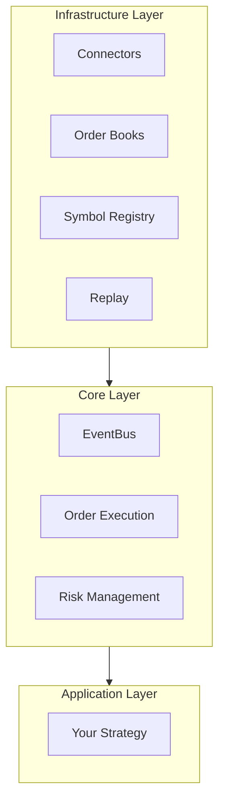
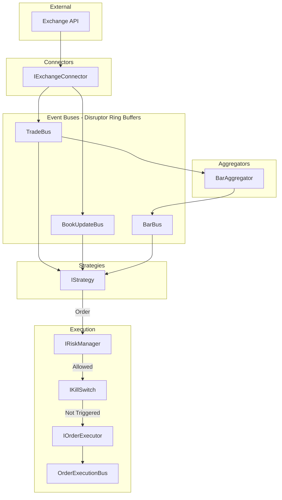
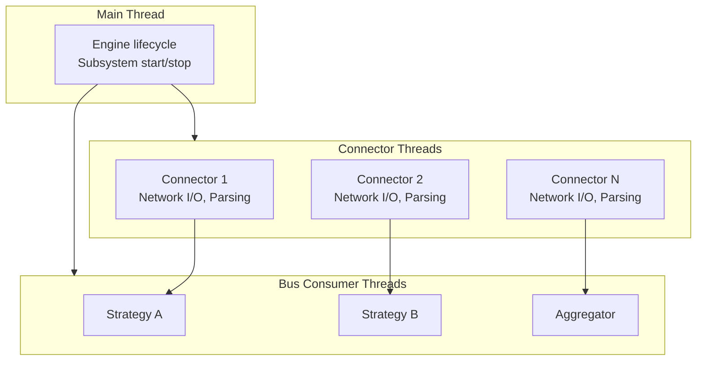

# Architecture Overview

How FLOX components fit together.

## System Layers



| Layer | Components | Purpose |
|-------|------------|---------|
| **Infrastructure** | Connectors, Replay, Symbol Registry, Order Books | Low-level I/O and data management |
| **Core** | EventBus, Order Execution, Risk Management | Event routing and order flow |
| **Application** | Your Strategy | Trading logic |

## Data Flow



## Core Components

### Engine

The `Engine` class orchestrates the system lifecycle:

```cpp
class Engine : public ISubsystem
{
public:
  Engine(const EngineConfig& config,
         std::vector<std::unique_ptr<ISubsystem>> subsystems,
         std::vector<std::shared_ptr<IExchangeConnector>> connectors);

  void start() override;
  void stop() override;
};
```

- Takes ownership of all subsystems
- Starts subsystems first, then connectors
- Stops connectors first, then subsystems
- No configuration file parsing — you wire components manually

### Event Buses

All buses use the Disruptor pattern (see [The Disruptor Pattern](disruptor.md)):

| Bus | Event Type | Purpose |
|-----|------------|---------|
| `TradeBus` | `TradeEvent` | Individual trades |
| `BookUpdateBus` | `pool::Handle<BookUpdateEvent>` | Order book snapshots/deltas |
| `BarBus` | `BarEvent` | OHLCV bars |
| `OrderExecutionBus` | `OrderEvent` | Order state changes |

Key characteristics:

- Lock-free ring buffer
- Single producer, multiple consumers
- Consumers run in dedicated threads
- Backpressure via sequence gating

### Connectors

`IExchangeConnector` interface:

```cpp
class IExchangeConnector
{
public:
  virtual ~IExchangeConnector() = default;
  virtual void start() = 0;
  virtual void stop() = 0;
  virtual std::string exchangeId() const = 0;
};
```

Connectors:

- Parse exchange-specific wire protocols
- Convert to FLOX event types
- Publish to event buses
- Run their own network threads

### Strategies

`IStrategy` combines `ISubsystem` + `IMarketDataSubscriber`:

```cpp
class IStrategy : public ISubsystem, public IMarketDataSubscriber
{
public:
  virtual ~IStrategy() = default;
};
```

From `IMarketDataSubscriber`:

- `onTrade(const TradeEvent&)`
- `onBookUpdate(const BookUpdateEvent&)`
- `onBar(const BarEvent&)`

From `ISubsystem`:

- `start()`
- `stop()`

## Subsystem Interface

Everything that participates in engine lifecycle implements:

```cpp
class ISubsystem
{
public:
  virtual ~ISubsystem() = default;
  virtual void start() = 0;
  virtual void stop() = 0;
};
```

Subsystems include:

- Event buses
- Strategies
- Aggregators (e.g., BarAggregator)
- Execution trackers
- Custom components

## Symbol Management

Symbols are identified by `SymbolId` (`uint32_t`):

```cpp
SymbolRegistry registry;
registry.registerSymbol("binance", "BTCUSDT");  // Returns SymbolId
auto id = registry.getSymbolId("binance", "BTCUSDT");
```

Benefits:

- Fast comparison (integer vs string)
- Compact event structures
- Consistent across components

## Type System

FLOX uses strong types to prevent unit confusion:

| Type | Underlying | Purpose |
|------|------------|---------|
| `Price` | Fixed-point | Prices (avoid floating-point) |
| `Quantity` | Fixed-point | Quantities |
| `SymbolId` | `uint32_t` | Symbol identifier |
| `OrderId` | `uint64_t` | Order identifier |
| `UnixNanos` | `int64_t` | Nanosecond timestamp |

## Threading Model



- Each connector manages its own threads
- Each bus consumer gets a dedicated thread
- Consumer threads can be pinned to isolated CPU cores

## CPU Affinity (Optional)

With `FLOX_ENABLE_CPU_AFFINITY=ON`:

```cpp
bus.setupOptimalConfiguration(EventBus::ComponentType::MARKET_DATA);
```

This:

- Pins consumer threads to isolated cores
- Sets real-time scheduling priority
- Enables NUMA-aware core assignment

See [Configure CPU Affinity](../how-to/cpu-affinity.md).

## Next Steps

- [The Disruptor Pattern](disruptor.md) — Deep dive into event delivery
- [Memory Model](memory-model.md) — Zero-allocation design
- [First Strategy](../tutorials/first-strategy.md) — Write your first strategy
