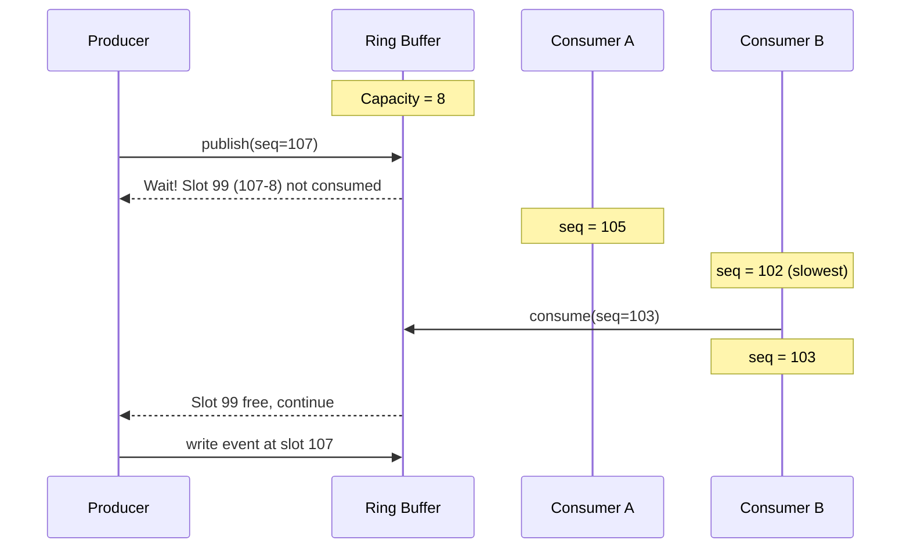
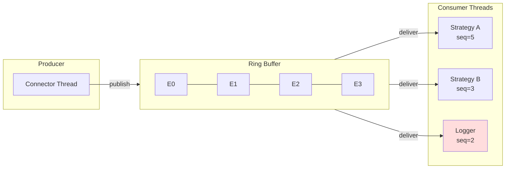

# The Disruptor Pattern

Why FLOX uses ring buffers for event delivery.

## The Problem

Traditional publish-subscribe systems have bottlenecks:

```
Producer → Queue → Consumer
           ↑
           └── Contention point
               - Locks
               - Allocations
               - Cache misses
```

For each event:
1. **Lock acquisition** — Wait for mutex
2. **Memory allocation** — Create queue node
3. **Cache invalidation** — Producer and consumer fight over cache lines

At millions of events per second, these costs add up.

## The Disruptor Solution

The Disruptor pattern (from LMAX Exchange) eliminates these costs:

```
┌────────────────────────────────────────────────────────┐
│                    Ring Buffer                         │
│  ┌────┬────┬────┬────┬────┬────┬────┬────┐             │
│  │ E0 │ E1 │ E2 │ E3 │ E4 │ E5 │ E6 │ E7 │             │
│  └────┴────┴────┴────┴────┴────┴────┴────┘             │
│       ↑                        ↑                       │
│    Consumer                 Producer                   │
│    Sequence                 Sequence                   │
└────────────────────────────────────────────────────────┘
```

Key insights:
1. **Pre-allocated array** — No allocation during publishing
2. **Sequence numbers** — Atomic counters replace locks
3. **Cache-line padding** — False sharing eliminated
4. **Batching** — Consumers can process multiple events

## FLOX Implementation

FLOX's `EventBus` implements a Disruptor-style ring buffer:

```cpp
template <typename Event,
          size_t CapacityPow2 = config::DEFAULT_EVENTBUS_CAPACITY,
          size_t MaxConsumers = config::DEFAULT_EVENTBUS_MAX_CONSUMERS>
class EventBus : public ISubsystem;
```

### Publishing

```cpp
// Producer claims slot via atomic increment
int64_t seq = _next.fetch_add(1);

// Wait for consumers to free the slot
while (seq - CapacityPow2 > minConsumerSequence()) {
  backoff.pause();
}

// Write event directly into ring buffer
_storage[seq & Mask] = event;
_published[seq & Mask].store(seq);  // Signal consumers
```

### Consuming

Each consumer runs in a dedicated thread:

```cpp
while (running) {
  // Wait for next sequence
  while (_published[seq & Mask] != seq) {
    backoff.pause();
  }

  // Process event
  listener->onTrade(_storage[seq & Mask]);

  // Advance sequence
  _consumers[i].seq.store(seq);
}
```

## Sequence Gating

Producers wait for the slowest consumer before overwriting slots:



**Gating Logic:**
```
Producer Sequence: 107
Consumer A Sequence: 105
Consumer B Sequence: 102  ← Slowest (gating sequence)
Ring Buffer Size: 8

Producer can advance to: 102 + 8 = 110
```

This provides **backpressure** — fast producers can't overwhelm slow consumers.

## Cache-Line Optimization

The Disruptor uses padding to prevent false sharing:

```cpp
// Without padding: False sharing
struct Bad {
  std::atomic<int64_t> producer_seq;
  std::atomic<int64_t> consumer_seq;  // Same cache line!
};

// With padding: No false sharing
alignas(64) std::atomic<int64_t> producer_seq;
alignas(64) std::atomic<int64_t> consumer_seq;
```

FLOX uses `alignas(64)` throughout `EventBus`:

```cpp
alignas(64) std::atomic<bool> _running{false};
alignas(64) std::atomic<int64_t> _next{-1};
alignas(64) std::atomic<int64_t> _cachedMin{-1};
// ...
alignas(64) std::array<ConsumerSlot, MaxConsumers> _consumers{};
alignas(64) std::array<std::atomic<int64_t>, MaxConsumers> _gating{};
```

## Busy-Spin vs. Blocking

Consumers use adaptive backoff:

```cpp
class BusyBackoff {
  void pause() {
    if (++_spins < 100) {
      // CPU pause instruction
      _mm_pause();
    } else if (_spins < 200) {
      // Yield to scheduler
      std::this_thread::yield();
    } else {
      // Short sleep
      std::this_thread::sleep_for(1us);
    }
  }
};
```

This balances latency (busy-spin) with CPU usage (sleep).

## Multiple Consumers

FLOX supports multiple consumers per bus:



```cpp
tradeBus->subscribe(strategyA.get());
tradeBus->subscribe(strategyB.get());
tradeBus->subscribe(logger.get());
```

Each consumer:
- Gets a dedicated thread
- Maintains its own sequence
- Processes events independently

The producer waits for the **slowest** consumer before overwriting.

## Required vs. Optional Consumers

```cpp
// Required (default): affects backpressure
tradeBus->subscribe(strategyA.get(), /*required=*/true);

// Optional: doesn't gate the producer
tradeBus->subscribe(logger.get(), /*required=*/false);
```

Optional consumers:
- Won't slow down the system if they fall behind
- May miss events if too slow
- Useful for monitoring, logging, metrics

## Performance Characteristics

| Metric | Notes |
|--------|-------|
| Publish latency | Lock-free atomic operations only |
| Consume latency | Depends on backoff strategy and load |
| Throughput | Limited by slowest consumer |
| Memory overhead | Fixed: `sizeof(Event) × Capacity` |

Actual numbers depend heavily on:
- CPU architecture and cache hierarchy
- Whether cores are isolated
- Event size and consumer callback complexity
- System load

Run benchmarks on your target hardware to establish baseline.

## When Disruptor Shines

**Good fit:**

- High-throughput, low-latency requirements
- Predictable memory usage
- Single producer, multiple consumers
- Events are processed in order

**Not ideal for:**

- Multiple producers (requires coordination)
- Unbounded queues
- Very uneven consumer speeds

## Configuration

```cpp
// Custom capacity and consumer limit
using MyBus = EventBus<TradeEvent,
                       /*CapacityPow2=*/16384,
                       /*MaxConsumers=*/32>;
```

Capacity must be a power of 2 (for fast modulo via bitmask).

## Further Reading

- [LMAX Disruptor Paper](https://lmax-exchange.github.io/disruptor/disruptor.html)
- [Memory Model](memory-model.md) — How FLOX handles event ownership
- [Architecture Overview](architecture.md) — Full system design
