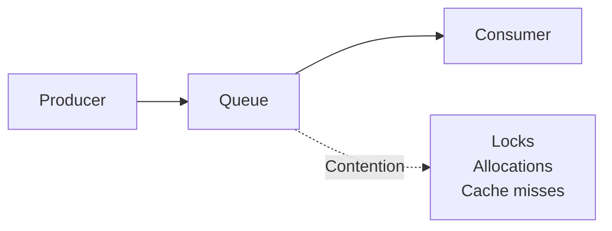
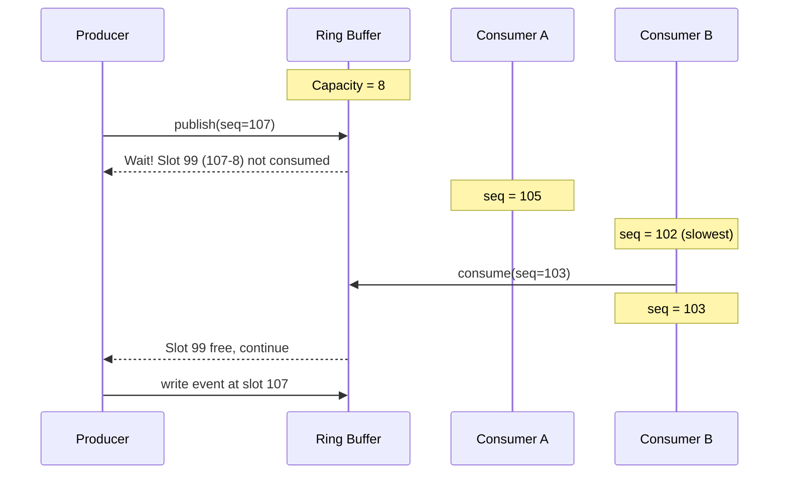
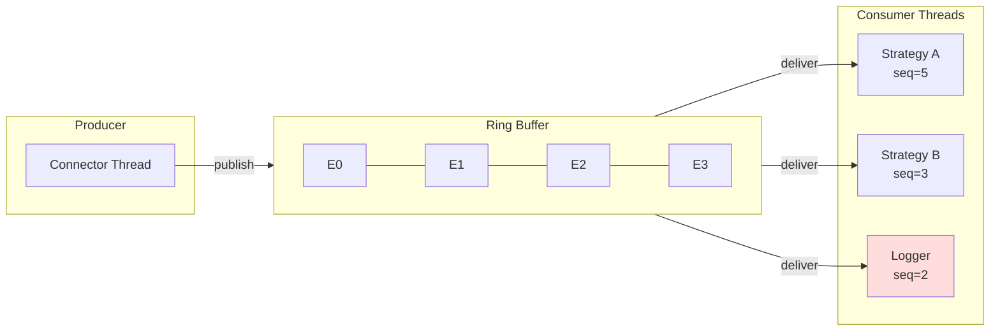

# The Disruptor Pattern

!!! info "Internals — for context only"
    This page describes how the C++ engine delivers events between threads. If you write strategies in Python, Node.js, or Codon, you don't see any of this directly — you just receive events in your callbacks. Read this if you want to understand *why* FLOX scales the way it does, not because you need it to write code.

Why FLOX uses ring buffers for event delivery.

## The Problem

Traditional publish-subscribe systems have bottlenecks:


```mermaid
flowchart LR
    P[Producer] --> Q[Queue]
    Q --> C[Consumer]
    Q -.->|Contention| X[Locks<br/>Allocations<br/>Cache misses]
```

For each event:

1. **Lock acquisition** — Wait for mutex
2. **Memory allocation** — Create queue node
3. **Cache invalidation** — Producer and consumer fight over cache lines

At millions of events per second, these costs add up.

## The Disruptor Solution

The Disruptor pattern (from LMAX Exchange) eliminates these costs:

```
              Ring Buffer (pre-allocated)

  [0] [1] [2] [3] [4] [5] [6] [7]
       ↑               ↑
    Consumer       Producer
    Sequence       Sequence
```

Key insights:

1. **Pre-allocated array** — No allocation during publishing
2. **Sequence numbers** — Atomic counters replace locks
3. **Cache-line padding** — False sharing eliminated
4. **Batching** — Consumers can process multiple events

## FLOX Implementation

FLOX's `EventBus` implements a Disruptor-style ring buffer:

```cpp
template <typename Event,
          size_t CapacityPow2 = config::DEFAULT_EVENTBUS_CAPACITY,
          size_t MaxConsumers = config::DEFAULT_EVENTBUS_MAX_CONSUMERS>
class EventBus : public ISubsystem;
```

### Publishing

```cpp
// Producer claims slot via atomic increment
int64_t seq = _next.fetch_add(1);

// Wait for consumers to free the slot
while (seq - CapacityPow2 > minConsumerSequence()) {
  backoff.pause();
}

// Write event directly into ring buffer
_storage[seq & Mask] = event;
_published[seq & Mask].store(seq);  // Signal consumers
```

### Consuming

Consuming is one step; running it forever is a separate decision:

```cpp
// The step: everything published and contiguous right now, up to a run cap.
// Returns false when there was nothing for this consumer.
bool pollOnce(i, listener) {
  while (_published[seq & Mask] == seq && run < maxRun) {
    listener->onTrade(_storage[seq & Mask]);  // dispatch
    ++seq; ++run;
  }
  if (nothing) return false;
  _consumers[i].seq.store(last);              // progress, published once
  return true;
}

// The default way to keep taking it: one thread per consumer.
while (running) {
  if (!pollOnce(i, listener)) backoff.pause();
}
```

By default each consumer gets that thread. See
[Consumers without a thread of their own](#consumers-without-a-thread-of-their-own)
for when to take the step yourself.

## Sequence Gating

Producers wait for the slowest consumer before overwriting slots:


```mermaid
sequenceDiagram
    participant P as Producer
    participant RB as Ring Buffer
    participant CA as Consumer A
    participant CB as Consumer B

    Note over RB: Capacity = 8

    P->>RB: publish(seq=107)
    RB-->>P: Wait! Slot 99 (107-8) not consumed

    Note over CA: seq = 105
    Note over CB: seq = 102 (slowest)

    CB->>RB: consume(seq=103)
    Note over CB: seq = 103

    RB-->>P: Slot 99 free, continue
    P->>RB: write event at slot 107
```

**Gating Logic:**
```
Producer Sequence: 107
Consumer A Sequence: 105
Consumer B Sequence: 102  ← Slowest (gating sequence)
Ring Buffer Size: 8

Producer can advance to: 102 + 8 = 110
```

This provides **backpressure** — fast producers can't overwhelm slow consumers.

## Cache-Line Optimization

The Disruptor uses padding to prevent false sharing:

```cpp
// Without padding: False sharing
struct Bad {
  std::atomic<int64_t> producer_seq;
  std::atomic<int64_t> consumer_seq;  // Same cache line!
};

// With padding: No false sharing
alignas(64) std::atomic<int64_t> producer_seq;
alignas(64) std::atomic<int64_t> consumer_seq;
```

FLOX uses `alignas(64)` throughout `EventBus`:

```cpp
alignas(64) std::atomic<bool> _running{false};
alignas(64) std::atomic<int64_t> _next{-1};
alignas(64) std::atomic<int64_t> _cachedMin{-1};
// ...
alignas(64) std::array<ConsumerSlot, MaxConsumers> _consumers{};
alignas(64) std::array<std::atomic<int64_t>, MaxConsumers> _gating{};
```

## Busy-Spin vs. Blocking

Consumers use configurable backoff with three modes:

```cpp
enum class BackoffMode {
  AGGRESSIVE,  // Dedicated colo: busy-spin with CPU pause, minimal yields
  RELAXED,     // Shared VPS/cloud: early sleep, minimal CPU burn
  ADAPTIVE     // Auto-adjust: starts aggressive, backs off under contention
};

BusyBackoff backoff(BackoffMode::ADAPTIVE);  // Default
```

**AGGRESSIVE** — for dedicated hardware with isolated cores:

- 2048 spins with CPU pause
- Then yield, reset at 4096

**RELAXED** — for shared VPS/cloud environments:

- 8 spins, then yield
- Sleep 100μs after 16 spins
- Sleep 500μs for sustained idle

**ADAPTIVE** (default) — auto-adjusts based on contention:

- 128 spins with CPU pause (low-latency burst handling)
- 512 spins with yield (medium contention)
- Sleep 10μs up to 2048 spins
- Sleep 100μs and reset to medium level

This balances latency (busy-spin) with CPU usage (sleep) based on deployment environment.

Note what backoff does **not** do: a consumer never blocks. Even at its
laziest, ADAPTIVE wakes on a 100 μs sleep — ten thousand times a second, per
consumer, with nothing to do. On a 14-core machine one idle consumer thread
costs about 0.15–0.2 of a core. That is the right trade for one bus on
hardware it owns, and the wrong one for a process holding hundreds.

## Parking: the consumer that blocks

```cpp
bus.subscribe(&listener, /*required=*/true, ConsumerWaitMode::PARKED);
```

A parked consumer waits on a condition variable and is woken by the
publisher. Active waiting stays the default; parking is per consumer, so one
bus can carry both.

Measured on 14 cores (4096-slot ring, ADAPTIVE backoff for the active case):

| | idle CPU per consumer | wake-up after 2 ms idle | worst wake-up |
|---|---|---|---|
| active | ~0.2 core, always | ~10 μs | ~35 μs |
| parked | 0 | ~38 μs | ~1.2 ms |

That is the whole trade: parking gives back the core and costs roughly 4× on
a typical wake-up, with a tail that belongs to the scheduler rather than to
the bus. Publishing itself does not get slower — a bus with no parked
consumer pays one predictable branch, and a publisher that finds nobody
sleeping pays one atomic load.

**When to park:** many buses in one process (a venue with hundreds of
shards); a machine shared with anything else; consumers whose work is
measured in milliseconds anyway — persistence, reporting, anything that
already touches a disk or a socket.

**When not to:** one bus on hardware it owns, where the burning core IS the
product; the matching path of a latency-sensitive instrument.

How the wake-up cannot be lost: the consumer raises the waiter count *before*
its last look at the ring, with a sequentially consistent fence on both
sides, and holds the park mutex across the look and the wait — so a publisher
that misses the count cannot also be missed by the look, and one that sees it
cannot slip its notify into the gap. A timed wait sits under both as a net
(50 ms), which nothing is expected to reach: a test fails if wake-ups start
arriving on its schedule.

Parking is per consumer, and the condition variable belongs to one bus. That
is enough while a consumer IS a thread and nothing more; a thread stepping
consumers across many buses needs a wait point that does not belong to any of
them — see [one wait point over many buses](#one-wait-point-over-many-buses).

## Consumers without a thread of their own

```cpp
bus.setOwnConsumerThreads(false);   // before start()
bus.subscribe(&listener);
bus.start();                        // spawns nothing

// Your thread, your cadence, across as many consumers and buses as you like.
while (running) {
  bool any = false;
  for (uint32_t i = 0; i < bus.consumerCount(); ++i) {
    any |= bus.pollConsumer(i);
  }
  if (!any) backoff.pause();
}
```

Which shape to take:

These two are separate decisions: a consumer stepped from outside (below)
does its own waiting, so `WaitMode` applies to consumers the bus runs itself.

| | thread per consumer (default) | stepped from outside |
|---|---|---|
| when | one bus on a machine it owns; latency is the budget | many buses in one process; threads are the budget |
| idle cost | ~0.14 core per consumer, always | one waiting thread, however many consumers |
| latency | the measured numbers below | plus the time to get round to this consumer |
| who waits | the consumer | you, after every consumer came back empty |

Measured on 14 cores (publish to handler entry, 4096-slot ring, ADAPTIVE):

| | hot (consumer already spinning) | after 2 ms idle |
|---|---|---|
| latency | ~170 ns | ~9.3 μs |

The rules for stepping consumers yourself:

- **One stepper per consumer at a time.** `pollConsumer(i)` is the ring's
  single reader; two threads on one index is the same bug as two consumers
  sharing a gating slot, and nothing detects it.
- **Do not mix.** A consumer with its own thread must not also be stepped.
- **A slot can fail without taking you with it.** If a listener throws, that
  consumer is marked failed (`consumerFailed(i)`, and `DEAD` to the health
  layer), further steps on it do nothing, and every other consumer keeps
  going. Stepping many consumers means one bad handler must not stop the rest.
- **Health is progress, not presence.** A consumer nobody steps while work is
  pending reports `STALLED` after `stallThreshold` — the same as a consumer
  whose thread is stuck.
- **Drain before stop.** `drainConsumer(i)` hands over what is left in the
  ring; `stop()` also does it for you when `enableDrainOnStop()` is set and
  nobody owns a consumer thread.

### One wait point over many buses

A thread stepping consumers across many buses cannot block on any single one
of them without going deaf to the rest, so `WaitMode::PARKED` does nothing
for it and it has to spin — the cost parking exists to remove, moved up a
level and left there.

`WakeSet` is the wait point such a thread is missing: one condition variable,
one mutex, one waiter count, however many rings hang off it. Point every bus
the thread steps at the same set, and a publisher into any of them wakes it.

```cpp
flox::WakeSet set;

for (auto& bus : buses) {
  bus->setOwnConsumerThreads(false);
  bus->setWakeSet(&set);          // both before start()
  bus->subscribe(&listener);
  bus->start();
}

while (running) {
  bool any = false;
  for (auto& bus : buses) {
    for (uint32_t i = 0; i < bus->consumerCount(); ++i) {
      any |= bus->pollConsumer(i);
    }
  }
  if (any) continue;
  // The last look at every ring, taken inside the set's discipline.
  set.parkUnless([&] {
    for (auto& bus : buses) {
      for (uint32_t i = 0; i < bus->consumerCount(); ++i) {
        if (bus->consumerHasPending(i)) return true;
      }
    }
    return false;
  });
}
```

`parkUnless` takes the predicate rather than being called after a check
because the check has to happen *inside* the set's discipline: the window
between a waiter's last look and it raising its hand is exactly where a
wake-up gets lost. Same rules as `park()` — the count goes up before the
look, with a sequentially consistent fence on either side, and the mutex is
held across both the look and the wait. The predicate therefore runs under
that mutex: keep it to `consumerHasPending`, and never deliver from it.

`consumerHasPending(i)` is the look `pollConsumer(i)` starts with, without
the delivery. It reads the stepping driver's own cursor, so it belongs to
whoever steps that consumer and to nobody else.

Measured on 14 cores, one thread over N buses, 1024-slot rings, ADAPTIVE
backoff for the spinning case (the numbers for one consumer on its own thread
are in [Parking](#parking-the-consumer-that-blocks) above):

| buses on the thread | idle CPU, backoff | idle CPU, wake set |
|---|---|---|
| 1 | 0.11 core | 0 |
| 3 | 0.11 core | 0 |
| 16 | 0.11 core | 0 |
| 64 | 0.12 core | 0 |

The backoff figure is flat because it is one thread either way — that is the
point of stepping — and it is the whole thread, idle, forever. Wake-up
latency, publish to handler entry after 2 ms of quiet, same run:

| wait | wake-up | worst |
|---|---|---|
| backoff, 3 buses | 9.1 μs | 51 μs |
| backoff, 16 buses | 10.8 μs | 101 μs |
| wake set, 3 buses | 5.7 μs | 9.8 μs |
| wake set, 16 buses | 5.9 μs | 28 μs |

So the set is not a latency trade here, unlike parking a single consumer: a
thread that has to walk N rings before it can find anything is slower at
noticing than one that is woken and told to look. The tail behaves better for
the same reason.

A bus nobody points at a set is untouched: `setWakeSet` is what turns the
wake-up on, the publish path reads one flag covering both it and parked
consumers, and a bus with neither pays one predictable branch.

## Multiple Consumers

FLOX supports multiple consumers per bus:


```mermaid
flowchart LR
    subgraph Producer
        P[Connector Thread]
    end

    subgraph RB[Ring Buffer]
        direction LR
        S0[E0] --- S1[E1] --- S2[E2] --- S3[E3]
    end

    subgraph Consumers[Consumer Threads]
        C1[Strategy A<br/>seq=5]
        C2[Strategy B<br/>seq=3]
        C3[Logger<br/>seq=2]
    end

    P -->|publish| RB
    RB -->|deliver| C1
    RB -->|deliver| C2
    RB -->|deliver| C3

    style C3 fill:#fdd
```

```cpp
tradeBus->subscribe(strategyA.get());
tradeBus->subscribe(strategyB.get());
tradeBus->subscribe(logger.get());
```

Each consumer:

- Gets a dedicated thread
- Maintains its own sequence
- Processes events independently

The producer waits for the **slowest** consumer before overwriting.

## Required vs. Optional Consumers

```cpp
// Required (default): affects backpressure
tradeBus->subscribe(strategyA.get(), /*required=*/true);

// Optional: does not gate wrap, but still gates the reclaim fence by default
tradeBus->subscribe(logger.get(), /*required=*/false);
```

Optional consumers:

- Do not gate the producer at wrap, but the reclaim fence still scans every
  consumer (use-after-free protection), so by default a slow optional consumer
  DOES stall `publish()`. Enable `dropBehindOptional` in `HealthConfig` to let
  them jump ahead instead.
- With `dropBehindOptional`, may miss events if too slow (skipped events are
  counted, never silently lost); without it, they block rather than miss.
- Useful for monitoring, logging, metrics

## Batch Publishing

WebSocket feeds already deliver batches: a depth message carries every level
that changed, and a busy trade stream packs several trades into one frame.
`publishBatch` keeps that shape instead of splitting it into per-event
publishes:

```cpp
// evs is a contiguous array, count <= CapacityPow2 / 2
int64_t lastSeq = tradeBus->publishBatch(evs, count);
```

One call reserves the whole sequence range at once, waits once for ring
space, then stamps every slot under a single release fence. Per-event
`publish()` pays a sequence reservation, a wrap check and a release store
for every event; the batch pays each of those once. On our benchmark
hardware that is the difference between ~19M and ~275M events/s with one
consumer (`benchmarks/batch_delivery_benchmark.cpp`).

Batching costs nothing on the latency side. A batch is whatever the producer
already has in hand, so a single event still goes through alone, and
delivery latency under bursty load measures the same as the per-event path.

Consumers batch on their own: a consumer that wakes up delivers the whole
contiguous run of published events (up to 1024) and stores its progress once
at the end of the run, instead of updating two atomics per event. This works
for both publish paths and needs nothing from the caller.

## Bounded Publishing

`publish()` waits as long as it takes. `tryPublish()` gives the producer a
deadline instead, and returns what happened:

```cpp
auto [result, seq] = tradeBus->tryPublish(ev, std::chrono::microseconds{500});
if (result == MyBus::PublishResult::TIMEOUT) {
  // the ring was full for 500us; the event was not published
}
```

A timeout means the event never entered the ring. Nothing was reserved, no
slot was written, no sequence number was spent, and the next accepted publish
takes the sequence this one would have had. Events already in the ring are
untouched and keep flowing to consumers. `stats().dropped` counts the refusals,
so backpressure stays visible.

The two publish paths get there differently. Blocking `publish()` takes its
sequence first, with one atomic increment, then waits for ring space; it never
gives up, so the sequence it took is always honoured. A bounded publish cannot
work that way. A sequence taken and then abandoned still has to be written into
the ring for consumers to get past it, and that write lands on the slot of an
event the slowest consumer has not read yet. So `tryPublish()` takes its
sequence last, with a compare-exchange, once the ring already has room. Giving
up before that point costs nothing.

Backpressure on `tryPublish()` is a normal condition. Handle the `TIMEOUT`
(drop, retry, shed load) and keep publishing.

## Stopping and Restarting

`EventBus` is an `ISubsystem`: it has `start()` and `stop()`, and a bus can go
through that cycle more than once. A reconnect that rebuilds a feed stops its
subsystems and starts them again.

`stop()` joins every consumer thread, destroys whatever events the ring still
holds, and puts the sequence line back where a fresh bus starts. A restarted
bus numbers its events from zero again, so sequence numbers are unique within a
run, not across runs. Anything that persists a `tickSequence` past a restart
needs its own run identifier.

Publishes racing `stop()` are not ordered against it, and never were. Publish
from the producer thread, then stop.

### Draining

By default `stop()` drops whatever the consumers have not reached yet.
`enableDrainOnStop()` makes each consumer finish the events already published
before its thread exits:

```cpp
tradeBus->enableDrainOnStop();
```

The drain delivers them through the same path as the running loop, end-of-batch
edge included. A listener that batches its work needs that edge: it commits what
it was handed only when it is told the ingress is drained, which is where one
durability barrier covers a whole batch instead of one per event. The drain
gives it that edge at the end, and every 1024 events along the way, so a
shutdown commits what it applied rather than leaving it staged.

## Static Subscription

`subscribe()` takes a listener interface pointer and dispatches through a
virtual call. `subscribeStatic` takes a concrete type instead:

```cpp
struct PriceLogger
{
  void onTrade(const TradeEvent& ev) { /* ... */ }
};

PriceLogger logger;
tradeBus->subscribeStatic(&logger);
```

The consumer loop is instantiated around the concrete type, so the handler
call is direct and can inline. The type only needs the handler methods the
event's dispatcher calls; it does not have to derive from the listener
interface. On a live bus the difference is small, because the producer side
dominates. The same mechanism is what makes StrategyPump fast in replay,
where there is no producer to hide behind.

## Performance Characteristics

| Metric | Notes |
|--------|-------|
| Publish latency | Wait-free when the ring has space; blocks with backoff (see Degradation) when a consumer lags |
| Consume latency | Depends on backoff strategy and load |
| Throughput | Limited by slowest consumer |
| Memory overhead | Fixed: `sizeof(Event) × Capacity` |

Actual numbers depend heavily on:
- CPU architecture and cache hierarchy
- Whether cores are isolated
- Event size and consumer callback complexity
- System load

Run benchmarks on your target hardware to establish baseline.

## When Disruptor Shines

**Good fit:**

- High-throughput, low-latency requirements
- Predictable memory usage
- Single producer, multiple consumers
- Events are processed in order

**Not ideal for:**

- Multiple producers (requires coordination)
- Unbounded queues
- Very uneven consumer speeds

## Configuration

```cpp
// Custom capacity and consumer limit
using MyBus = EventBus<TradeEvent,
                       /*CapacityPow2=*/16384,
                       /*MaxConsumers=*/32>;
```

Capacity must be a power of 2 (for fast modulo via bitmask).

## Degradation modes and consumer health

A stalled consumer freezes the whole bus, and without instrumentation it
freezes silently. Configure the health layer if you run the bus anywhere a
frozen publisher costs money.

Why a single consumer can stop everything: a required consumer that stops
advancing blocks the publisher at wrap gating, and an optional one blocks
it at the reclaim fence, because use-after-free protection waits for every
consumer before destroying old events. In both cases the publisher spins in
`publish()` and nothing in the logs says why.

The health layer gives each failure mode a detector and a policy:

- Stalls. `checkHealth()` sweeps all consumers and fires the callback with
  `STALLED` when one has pending work but no progress for
  `stallThreshold`, then `HEALTHY` again on recovery. Call it from your own
  health thread or set `enableMonitorThread` to poll automatically. One
  sweeping thread at a time; the bookkeeping is not synchronized between
  checkers.
- Slow optional consumers. With `dropBehindOptional`, an optional consumer
  more than `dropBehindSlack` events behind jumps to the head instead of
  blocking the reclaim fence. The skipped count is in
  `stats().droppedBehind`. Required consumers never drop events.
- Dead consumers. A handler that throws kills its consumer loop and logs an
  error. Swallowing the exception would keep a broken handler running, and
  rethrowing would terminate the process, so the consumer dies and the next
  sweep reports `DEAD`. For a required consumer, `deadPolicy` picks between
  `ALERT` and `STOP_BUS`.

```cpp
MyBus::HealthConfig cfg;
cfg.stallThreshold = std::chrono::milliseconds(50);
cfg.dropBehindOptional = true;
cfg.enableMonitorThread = true;
cfg.callback = [](uint32_t idx, MyBus::ConsumerHealth st, void*) { /* metrics */ };
bus.setHealthConfig(cfg);  // before start()
```

## Further Reading

- [LMAX Disruptor Paper](https://lmax-exchange.github.io/disruptor/disruptor.html)
- [Memory Model](memory-model.md) — How FLOX handles event ownership
- [Architecture Overview](architecture.md) — Full system design
