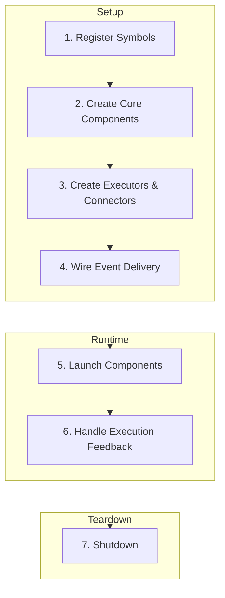

# Integration Flow

Step-by-step guide to integrating FLOX components into a complete trading system.

## Overview



## 1. Register Symbols

Before anything else, define which trading instruments the system will operate on. Each symbol is registered with an internal registry, which assigns a unique identifier and stores metadata.

```cpp
#include "flox/engine/symbol_registry.h"

SymbolRegistry registry;

// Register symbols with exchange and instrument info
auto btcId = registry.registerSymbol("binance", "BTCUSDT", InstrumentType::PERPETUAL);
auto ethId = registry.registerSymbol("binance", "ETHUSDT", InstrumentType::PERPETUAL);

// Retrieve later by name
auto symbolId = registry.getSymbolId("binance", "BTCUSDT");
```

**Key points:**

- `SymbolId` is a compact integer for fast comparison
- Registry maps `(exchange, symbol)` pairs to `SymbolId`
- Metadata includes instrument type, tick size, lot size

## 2. Create Core Components

Several core components must be created and wired together:

```cpp
#include "flox/book/bus/trade_bus.h"
#include "flox/book/bus/book_update_bus.h"
#include "flox/execution/bus/order_execution_bus.h"
#include "flox/execution/order_tracker.h"

// Event buses for market data
auto tradeBus = std::make_unique<TradeBus>();
auto bookBus = std::make_unique<BookUpdateBus>();

// Execution infrastructure
auto execBus = std::make_unique<OrderExecutionBus>();
auto orderTracker = std::make_unique<OrderTracker>();
```

**Component responsibilities:**

| Component | Purpose |
|-----------|---------|
| `SymbolRegistry` | Resolve and map symbols |
| `OrderTracker` | Monitor orders and maintain state |
| `TradeBus` | Distribute trade events |
| `BookUpdateBus` | Distribute order book updates |
| `OrderExecutionBus` | Distribute execution events |

## 3. Create Executors and Connectors

```cpp
#include "flox/execution/abstract_executor.h"
#include "flox/connector/abstract_exchange_connector.h"

// Order executor sends orders to exchange
auto executor = std::make_unique<BinanceExecutor>(
    transport,
    registry,
    orderTracker.get()
);

// Connector receives market data
auto connector = std::make_shared<BinanceConnector>(
    registry,
    *tradeBus,
    *bookBus
);
```

**Executor responsibilities:**

- Send orders to exchange
- Report order status updates
- Update order tracker

**Connector responsibilities:**

- Connect to exchange (WebSocket, REST, FIX)
- Parse wire protocol
- Publish events to buses

## 4. Wire Event Delivery

Configure buses to distribute events to subscribers:

```cpp
#include "flox/strategy/istrategy.h"

// Create strategy
auto strategy = std::make_unique<MyStrategy>(executor.get());

// Subscribe to market data
tradeBus->subscribe(strategy.get());
bookBus->subscribe(strategy.get());

// Subscribe to execution events
execBus->subscribe(strategy.get());

// Add optional subscribers
tradeBus->subscribe(logger.get(), /*optional=*/true);
tradeBus->subscribe(metrics.get(), /*optional=*/true);
```

**Subscriber types:**

| Type | Behavior |
|------|----------|
| Required | System waits for slow consumers |
| Optional | May miss events if too slow |

**Common subscribers:**

- Trading strategies
- Data aggregators (candles, VWAP)
- Metric collectors
- Risk modules
- Loggers

## 5. Launch Components

Start components in the correct order:

```cpp
#include "flox/engine/engine.h"

// Collect all subsystems
std::vector<std::unique_ptr<ISubsystem>> subsystems;
subsystems.push_back(std::move(tradeBus));
subsystems.push_back(std::move(bookBus));
subsystems.push_back(std::move(execBus));
subsystems.push_back(std::move(strategy));

// Collect connectors
std::vector<std::shared_ptr<IExchangeConnector>> connectors;
connectors.push_back(connector);

// Create and start engine
EngineConfig config = loadConfig("config.json");
Engine engine(config, std::move(subsystems), std::move(connectors));

engine.start();  // Blocks until shutdown signal
```

**Startup sequence:**

1. Event buses start threads
2. Connectors establish connections
3. Strategies begin processing
4. Executors ready to handle orders

## 6. Handle Execution Feedback

When orders are submitted, the system maintains consistency:

```cpp
// In your executor implementation
void MyExecutor::onOrderFill(const FillMessage& msg) {
    // Update tracker
    _orderTracker->updateOrder(msg.orderId, OrderStatus::FILLED);

    // Emit event
    OrderEvent event;
    event.order.orderId = msg.orderId;
    event.order.status = OrderStatus::FILLED;
    event.order.filledQty = msg.quantity;
    event.order.avgPrice = msg.price;

    _execBus->publish(event);
}
```

**Order lifecycle:**
```
PENDING → SUBMITTED → PARTIALLY_FILLED → FILLED
                  ↘ REJECTED
                  ↘ CANCELED
```

## 7. Shutdown Procedure

Graceful shutdown ensures no data loss:

```cpp
// Signal shutdown (e.g., from signal handler)
engine.stop();

// Or programmatically
void gracefulShutdown() {
    // Stop accepting new orders
    executor->stop();

    // Stop connectors (no new market data)
    for (auto& conn : connectors) {
        conn->stop();
    }

    // Stop buses (drains queues)
    tradeBus->stop();
    bookBus->stop();
    execBus->stop();

    // Stop strategies
    strategy->stop();
}
```

**Shutdown order:**

1. Stop connectors (no new data)
2. Drain event buses
3. Stop strategies
4. Complete in-flight orders
5. Clean up resources

## Complete Example

```cpp
#include "flox/flox.h"

int main() {
    // 1. Registry
    SymbolRegistry registry;
    registry.registerSymbol("binance", "BTCUSDT");

    // 2. Core components
    auto tradeBus = std::make_unique<TradeBus>();
    auto bookBus = std::make_unique<BookUpdateBus>();
    auto execBus = std::make_unique<OrderExecutionBus>();

    // 3. Executor and connector
    auto executor = createExecutor(registry);
    auto connector = createConnector(registry, *tradeBus, *bookBus);

    // 4. Strategy
    auto strategy = std::make_unique<MyStrategy>(executor.get());
    tradeBus->subscribe(strategy.get());
    bookBus->subscribe(strategy.get());

    // 5. Engine
    std::vector<std::unique_ptr<ISubsystem>> subsystems;
    subsystems.push_back(std::move(tradeBus));
    subsystems.push_back(std::move(bookBus));
    subsystems.push_back(std::move(execBus));
    subsystems.push_back(std::move(strategy));

    std::vector<std::shared_ptr<IExchangeConnector>> connectors;
    connectors.push_back(connector);

    Engine engine(loadConfig(), std::move(subsystems), std::move(connectors));
    engine.start();

    return 0;
}
```

## Design Principles

| Principle | Implementation |
|-----------|----------------|
| **Modularity** | Components can be swapped independently |
| **Thread safety** | Lock-free constructs in hot paths |
| **Zero allocation** | Pre-allocated pools and ring buffers |
| **Determinism** | Sync mode available for backtesting |

## See Also

- [Architecture](architecture.md) — Component overview
- [Run the Demo](../tutorials/demo.md) — See integration in action
- [Configuration](../how-to/configuration.md) — Configure the system
