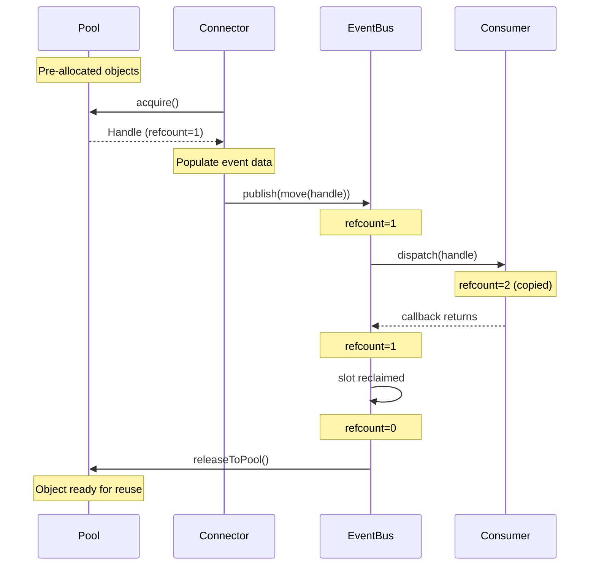

# Memory Model

Zero-allocation event delivery in FLOX.

## The Problem

Dynamic memory allocation is slow and unpredictable:

```cpp
// This allocates memory — bad in hot path
auto event = std::make_shared<TradeEvent>();
tradeBus.publish(event);
```

Each allocation:
- May trigger system calls
- Causes unpredictable latency
- Fragments the heap
- Increases cache misses

## FLOX's Solution

FLOX eliminates allocations in the hot path through:

1. **Pre-allocated ring buffers** — Events stored directly in `EventBus`
2. **Object pools** — Reusable event objects for large events
3. **Reference counting** — Automatic lifetime management without smart pointer overhead

## Small Events: Direct Storage

For small events like `TradeEvent`, the Disruptor stores them directly:

```cpp
// EventBus internal storage
std::array<Storage, CapacityPow2> _storage{};

// Publishing: placement new directly into ring buffer
::new (slot_ptr(idx)) Event(std::forward<Ev>(ev));
```

No allocation happens — the event is copied into pre-allocated storage.

## Large Events: Object Pools

For large events like `BookUpdateEvent` (contains vectors of bid/ask levels), FLOX uses pools:

```cpp
// Pool pre-allocates N objects at startup
pool::Pool<BookUpdateEvent, 128> bookPool;

// Acquire returns a Handle (reference-counted smart pointer)
auto handle = bookPool.acquire();
if (handle) {
  (*handle)->update.symbol = symbolId;
  (*handle)->update.bids = {...};

  // Publish the handle, not the event
  bookBus.publish(std::move(handle));
}
```

### Pool Design

```
┌──────────────────────────────────────────────────────────────┐
│                         Pool<T, N>                           │
├──────────────────────────────────────────────────────────────┤
│  Pre-allocated slots: [T] [T] [T] [T] [T] [T] ... [T]       │
│                                                              │
│  Free queue: → [ptr] → [ptr] → [ptr] →                      │
│                                                              │
│  acquire(): pop from free queue, return Handle<T>           │
│  release(): push back to free queue                         │
└──────────────────────────────────────────────────────────────┘
```

Key properties:
- All objects allocated at pool construction
- `acquire()` is O(1) — pops from lock-free queue
- `release()` is O(1) — pushes back
- No heap allocation during operation

### The Handle Class

`pool::Handle<T>` is a reference-counted smart pointer:

```cpp
template <typename T>
class Handle {
  T* _ptr;

  // Copy: increment ref count
  Handle(const Handle& other) : _ptr(other._ptr) {
    retain(_ptr);
  }

  // Move: transfer ownership
  Handle(Handle&& other) : _ptr(other._ptr) {
    other._ptr = nullptr;
  }

  // Destructor: decrement ref count, maybe return to pool
  ~Handle() {
    if (_ptr && _ptr->release()) {
      _ptr->releaseToPool();  // Returns to pool when refcount hits 0
    }
  }
};
```

Benefits:
- Automatic lifetime management
- Can be safely copied to multiple consumers
- Returns to pool when last reference dies
- No `shared_ptr` overhead (no control block allocation)

### PoolableBase

Events that use pools inherit from `PoolableBase`:

```cpp
struct BookUpdateEvent : public pool::PoolableBase<BookUpdateEvent> {
  BookUpdate update;

  void clear() {
    update.bids.clear();
    update.asks.clear();
    // ... reset other fields
  }
};
```

The `clear()` method resets the object for reuse.

## Event Flow with Pools



**Text representation:**
```
Pool → Connector (acquire) → EventBus (publish) → Consumer (dispatch) → Pool (release)
```

## PMR (Polymorphic Memory Resources)

For events with variable-size data (like vectors), FLOX uses PMR:

```cpp
// In Pool constructor
std::array<std::byte, 128 * 1024> _buffer;         // Stack buffer
std::pmr::monotonic_buffer_resource _arena;        // Fast bump allocator
std::pmr::unsynchronized_pool_resource _pool;      // Pool allocator
```

When `BookUpdateEvent` allocates vectors for bids/asks:
1. Memory comes from the pre-allocated buffer
2. `monotonic_buffer_resource` provides fast bump-pointer allocation
3. No system calls, no heap fragmentation

## RefCountable Interface

```cpp
class RefCountable {
  std::atomic<uint32_t> _refCount{1};

public:
  void retain() {
    _refCount.fetch_add(1, std::memory_order_relaxed);
  }

  bool release() {
    return _refCount.fetch_sub(1, std::memory_order_acq_rel) == 1;
  }

  void resetRefCount() {
    _refCount.store(1, std::memory_order_relaxed);
  }
};
```

Atomic operations ensure thread safety across bus consumers.

## Best Practices

### Do

```cpp
// Acquire from pool, move into bus
if (auto handle = bookPool.acquire()) {
  (*handle)->update = buildUpdate();
  bookBus.publish(std::move(handle));
}

// Handle pool exhaustion
if (!handle) {
  // Log warning, skip event, or use fallback
}
```

### Don't

```cpp
// Don't hold handles longer than necessary
pool::Handle<BookUpdateEvent> cachedHandle;  // Bad: blocks pool slot

// Don't allocate in callbacks
void onTrade(const TradeEvent& ev) {
  auto data = std::make_unique<BigData>();  // Bad: allocation in hot path
}

// Don't store event pointers
void onBookUpdate(const BookUpdateEvent& ev) {
  _cachedEvent = &ev;  // Bad: event will be recycled
}
```

## Sizing Pools

Pool size = max concurrent uses + headroom:

```cpp
// If 3 consumers each take ~10ms to process, and events arrive at 1000/sec:
// In-flight events ≈ 3 consumers × 10ms × 1000/sec = 30
// Add headroom: 64 or 128

pool::Pool<BookUpdateEvent, 128> bookPool;
```

Signs your pool is too small:
- `acquire()` returns `nullopt`
- High latency spikes
- Dropped events

## Memory Layout

FLOX optimizes for cache efficiency:

```cpp
// Cache-line aligned atomics
alignas(64) std::atomic<int64_t> _next{-1};

// Contiguous event storage
std::array<Storage, CapacityPow2> _storage{};
```

This ensures:
- No false sharing between atomics
- Sequential access patterns for events
- Minimal cache misses

## Summary

| Component | Strategy | Allocation |
|-----------|----------|------------|
| `TradeBus` | Direct storage | Zero (ring buffer) |
| `BookUpdateBus` | Pool + Handle | Zero (pre-allocated) |
| Small events | Copy into bus | Zero |
| Large events | Pool acquire/release | Zero (at runtime) |
| Event vectors | PMR | Zero (from buffer) |

## Next Steps

- [The Disruptor Pattern](disruptor.md) — How the ring buffer works
- [Optimize Performance](../how-to/optimize-performance.md) — Tune for latency
