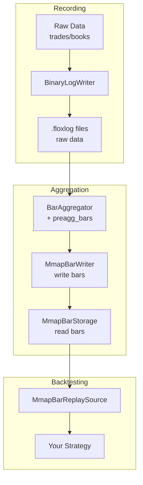

# Bar Aggregation Pipeline

This guide covers the complete workflow for working with bars in Flox: from raw market data to pre-aggregated bars for backtesting.

## Overview

The bar pipeline consists of several stages:



## Step 1: Record Raw Market Data

Use `BinaryLogWriter` to record trades and order book updates:

```cpp
#include "flox/replay/writers/binary_log_writer.h"

replay::WriterConfig config;
config.output_dir = "/data/bybit/BTCUSDT";
config.max_segment_bytes = 256 << 20;  // 256 MB per segment

replay::BinaryLogWriter writer(config);

// From your exchange connector:
writer.writeTrade(tradeRecord);
writer.writeBook(bookHeader, bids, asks);

writer.close();
```

## Step 2: Pre-aggregate Bars (Offline)

Use the `preagg_bars` tool to convert raw trades into bar files:

```bash
# Build with tools enabled
cmake -B build -DFLOX_ENABLE_TOOLS=ON -DFLOX_ENABLE_BACKTEST=ON
cmake --build build

# Run pre-aggregation
./build/tools/preagg_bars /data/bybit/BTCUSDT /data/bybit/BTCUSDT/bars 60 300 900 3600

# Output:
#   bars_60s.bin   (1-minute bars)
#   bars_300s.bin  (5-minute bars)
#   bars_900s.bin  (15-minute bars)
#   bars_3600s.bin (1-hour bars)
```

### Command-Line Options

```
Usage: preagg_bars <input_dir> <output_dir> [timeframe_seconds...]

Arguments:
  input_dir   Directory containing binary log files (.floxlog)
  output_dir  Directory to write bar files (will be created)
  timeframes  List of timeframe intervals in seconds (default: 60 300 900 3600)

Examples:
  preagg_bars data/BTCUSDT bars/BTCUSDT 60 300 900
  preagg_bars /path/to/trades /path/to/bars 60 300 900 1800 3600
```

## Step 3: Load Bars for Backtesting

Use `MmapBarStorage` to memory-map bar files for fast access:

```cpp
#include "flox/backtest/mmap_bar_storage.h"
#include "flox/backtest/mmap_bar_replay_source.h"

// Load bars
MmapBarStorage storage("/data/bybit/BTCUSDT/bars");

// Check available timeframes
for (auto tf : storage.timeframes()) {
    std::cout << "Timeframe: " << (tf.param / 1'000'000'000) << "s, "
              << storage.barCount(tf) << " bars\n";
}

// Get bars directly
auto tf1m = TimeframeId::time(std::chrono::seconds(60));
auto bars = storage.getBars(tf1m);  // std::span<const Bar>

// Or use replay source for backtesting
MmapBarReplaySource replaySource(storage, symbolId);
replaySource.replay([&](const BarEvent& ev) {
    myStrategy.onBar(ev);
});
```

## Alternative: Live Bar Aggregation

For real-time bar generation with persistence:

```cpp
#include "flox/aggregator/multi_timeframe_aggregator.h"
#include "flox/backtest/mmap_bar_writer.h"

BarBus bus;
MultiTimeframeAggregator<4> aggregator(&bus);

// Configure timeframes
aggregator.addTimeInterval(std::chrono::seconds(60));   // 1m
aggregator.addTimeInterval(std::chrono::seconds(300));  // 5m
aggregator.addTimeInterval(std::chrono::seconds(900));  // 15m
aggregator.addTimeInterval(std::chrono::seconds(3600)); // 1h

// Writer saves bars to disk
MmapBarWriter writer("/data/bybit/BTCUSDT/bars");
bus.subscribe(&writer);

// Start aggregation
aggregator.start();

// Feed trades from your connector
aggregator.onTrade(tradeEvent);
// ...

// Flush to disk
writer.flush();
```

## Bar File Format

Bar files use a simple binary format compatible with memory mapping:

```
[uint64_t]  bar_count
[Bar × N]   bar data
```

Each `Bar` struct contains:
- `open`, `high`, `low`, `close` - OHLC prices
- `volume`, `buyVolume` - Volume data
- `tradeCount` - Number of trades
- `startTime`, `endTime` - Time range
- `reason` - Close reason (Threshold, Gap, Forced, Warmup)

File naming convention: `bars_<seconds>s.bin` (e.g., `bars_60s.bin` for 1-minute bars)

## Available Bar Types

Flox supports multiple bar types through different policies:

| Type | Parameter | Description |
|------|-----------|-------------|
| Time | interval in seconds | Close bar every N seconds |
| Tick | count | Close bar after N trades |
| Volume | threshold | Close bar when volume exceeds threshold |
| Renko | brick size | Fixed price movement bars |
| Range | range | Close when high-low exceeds range |
| HeikinAshi | interval | Heikin-Ashi smoothed bars |

Example with tick bars:

```cpp
aggregator.addTickInterval(100);   // 100-trade bars
aggregator.addVolumeInterval(1000000);  // 1M volume bars
```

## Performance Tips

1. **Use mmap for large datasets** - `MmapBarStorage` memory-maps files, allowing the OS to manage memory efficiently.

2. **Pre-aggregate offline** - Use `preagg_bars` instead of aggregating during backtest for faster iteration.

3. **Choose appropriate timeframes** - Smaller timeframes = more bars = more processing.

4. **Batch flush writes** - `MmapBarWriter` buffers bars in memory; call `flush()` periodically for durability.
