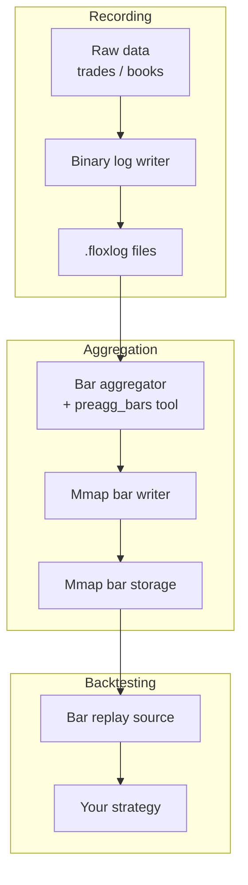

# Bar aggregation pipeline

Get from raw market data to bars you can backtest against. The pipeline has three stages — record, aggregate, replay — and each is reachable from every binding.


```mermaid
flowchart TB
    subgraph Recording
        RD[Raw data<br/>trades / books] --> BLW[Binary log writer]
        BLW --> FLX[.floxlog files]
    end

    subgraph Aggregation
        FLX --> BA[Bar aggregator<br/>+ preagg_bars tool]
        BA --> MBW[Mmap bar writer]
        MBW --> MBS[Mmap bar storage]
    end

    subgraph Backtesting
        MBS --> MBRS[Bar replay source]
        MBRS --> STR[Your strategy]
    end
```

## 1. Record raw data

Most users record from a live connector. The Python recorder writes the same `.floxlog` format as the C++ writer.

=== "Python"

    ```python
    import flox_py as flox
    import numpy as np

    w = flox.DataWriter("/data/bybit/BTCUSDT", max_segment_mb=256,
                        exchange_id=0, compression="none")
    w.write_trade(exchange_ts_ns=ts, recv_ts_ns=ts, price=p, qty=q,
                  trade_id=0, symbol_id=1, side=0)
    bids = np.array([(1005000000000, 50000000, 0)],
                    dtype=[("price_raw","i8"),("qty_raw","i8"),("side","u1")])
    asks = np.array([(1005100000000, 30000000, 1)], dtype=bids.dtype)
    w.write_book(exchange_ts_ns=ts, recv_ts_ns=ts, seq=0, symbol_id=1,
                 is_snapshot=True, bids=bids, asks=asks)
    w.close()
    ```

=== "Node.js"

    ```javascript
    const w = new flox.DataWriter("/data/bybit/BTCUSDT", 256, 0);
    w.writeTrade(tsNs, tsNs, price, qty, 0n, 1, 0);
    const bids = new BigInt64Array([1005000000000n, 50000000n]);
    const asks = new BigInt64Array([1005100000000n, 30000000n]);
    w.writeBook(tsNs, tsNs, 0n, 1, true, bids, asks);
    w.close();
    ```

=== "C++"

    ```cpp
    #include "flox/replay/writers/binary_log_writer.h"

    replay::WriterConfig config;
    config.output_dir = "/data/bybit/BTCUSDT";
    config.max_segment_bytes = 256 << 20;
    replay::BinaryLogWriter writer(config);

    writer.writeTrade(tradeRecord);
    writer.writeBook(bookHeader, bids, asks);
    writer.close();
    ```

## 2. Pre-aggregate bars (offline)

Run `preagg_bars` once per dataset; it writes one bar file per timeframe.

```bash
cmake -B build -DFLOX_ENABLE_TOOLS=ON -DFLOX_ENABLE_BACKTEST=ON
cmake --build build

./build/tools/preagg_bars /data/bybit/BTCUSDT /data/bybit/BTCUSDT/bars 60 300 900 3600
# bars_60s.bin   (1m)
# bars_300s.bin  (5m)
# bars_900s.bin  (15m)
# bars_3600s.bin (1h)
```

Same tool for every binding — it's a standalone CLI binary.

## 3. Load bars for backtesting

=== "Python"

    Bars come back as a structured numpy array. Pass directly to `BacktestRunner.run_bars(...)`:

    ```python
    storage = flox.MmapBarStorage("/data/bybit/BTCUSDT/bars")
    bars = storage.bars(timeframe_ns=60 * 1_000_000_000)   # 1-minute bars

    bt.run_bars(
        start_time_ns = bars["start_time_ns"],
        end_time_ns   = bars["end_time_ns"],
        open  = bars["open"],   high = bars["high"],
        low   = bars["low"],    close = bars["close"],
        volume = bars["volume"],
        symbol = "BTCUSDT",
    )
    ```

=== "Node.js"

    ```javascript
    const storage = new flox.MmapBarStorage("/data/bybit/BTCUSDT/bars");
    const bars = storage.bars(60n * 1_000_000_000n);
    bt.runBars(bars.startTimeNs, bars.endTimeNs,
                bars.open, bars.high, bars.low, bars.close, bars.volume,
                "BTCUSDT");
    ```

=== "C++"

    ```cpp
    #include "flox/backtest/mmap_bar_storage.h"
    #include "flox/backtest/mmap_bar_replay_source.h"

    MmapBarStorage storage("/data/bybit/BTCUSDT/bars");
    auto tf = TimeframeId::time(std::chrono::seconds(60));
    auto bars = storage.getBars(tf);                    // std::span<const Bar>

    MmapBarReplaySource replay(storage, symbolId);
    replay.replay([&](const BarEvent& ev) { strat.onBar(ev); });
    ```

## Live aggregation (no offline step)

For real-time bar generation while you trade, configure the aggregator with the timeframes you want and connect it to your strategy.

=== "C++"

    ```cpp
    BarBus bus;
    MultiTimeframeAggregator<4> aggregator(&bus);
    aggregator.addTimeInterval(std::chrono::seconds(60));    // 1m
    aggregator.addTimeInterval(std::chrono::seconds(300));   // 5m
    aggregator.addTimeInterval(std::chrono::seconds(900));   // 15m
    aggregator.addTimeInterval(std::chrono::seconds(3600));  // 1h

    MmapBarWriter writer("/data/bybit/BTCUSDT/bars");
    bus.subscribe(&writer);

    aggregator.start();
    aggregator.onTrade(tradeEvent);
    ```

=== "Python / Node.js"

    Live bar aggregation isn't yet exposed as an idiomatic Python/Node.js API — drive your strategy from `Runner.on_trade(...)` and accumulate bars yourself, or pre-aggregate with `preagg_bars` and replay.

## Bar types

| Type | Parameter | Description |
|---|---|---|
| Time | interval (seconds) | Close every N seconds |
| Tick | count | Close after N trades |
| Volume | threshold | Close when cumulative volume crosses threshold |
| Renko | brick size | Fixed price-move bars |
| Range | range | Close when high − low > range |
| BpsRange | bps | Range in basis points relative to bar open (works across price scales) |
| HeikinAshi | interval | Heikin-Ashi smoothed |

```cpp
aggregator.addTickInterval(100);          // 100-trade bars
aggregator.addVolumeInterval(1'000'000);  // 1M-volume bars
```

## File format

```
[uint64_t]  bar_count
[Bar × N]   bar data
```

Each `Bar` carries `open / high / low / close / volume / buyVolume / tradeCount / startTime / endTime / reason`. File naming: `bars_<seconds>s.bin`.

## Performance tips

1. **mmap for big data** — `MmapBarStorage` lets the OS manage paging
2. **Pre-aggregate offline** for repeated parameter sweeps
3. **Pick coarser timeframes** for faster iteration; smaller bars = more events
4. **Batch flushes** — `MmapBarWriter` buffers; call `flush()` periodically for durability

## See also

- [Custom bar policy](custom-bar-policy.md) — write your own aggregator
- [Bar types explained](../explanation/bar-types.md)
- [Backtesting](backtest.md)
