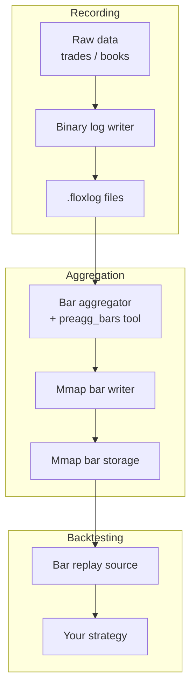

# Bar aggregation pipeline

Get from raw market data to bars you can backtest against. The pipeline has three stages — record, aggregate, replay — and each is reachable from every binding.


```mermaid
flowchart TB
    subgraph Recording
        RD[Raw data<br/>trades / books] --> BLW[Binary log writer]
        BLW --> FLX[.floxlog files]
    end

    subgraph Aggregation
        FLX --> BA[Bar aggregator<br/>+ preagg_bars tool]
        BA --> MBW[Mmap bar writer]
        MBW --> MBS[Mmap bar storage]
    end

    subgraph Backtesting
        MBS --> MBRS[Bar replay source]
        MBRS --> STR[Your strategy]
    end
```

## 1. Record raw data

Most users record from a live connector. The Python recorder writes the same `.floxlog` format as the C++ writer.

=== "Python"

    ```python
    import flox_py as flox
    import numpy as np

    w = flox.DataWriter("/data/bybit/BTCUSDT", max_segment_mb=256,
                        exchange_id=0, compression="none")
    w.write_trade(exchange_ts_ns=ts, recv_ts_ns=ts, price=p, qty=q,
                  trade_id=0, symbol_id=1, side=0)
    bids = np.array([(1005000000000, 50000000, 0)],
                    dtype=[("price_raw","i8"),("qty_raw","i8"),("side","u1")])
    asks = np.array([(1005100000000, 30000000, 1)], dtype=bids.dtype)
    w.write_book(exchange_ts_ns=ts, recv_ts_ns=ts, seq=0, symbol_id=1,
                 is_snapshot=True, bids=bids, asks=asks)
    w.close()
    ```

=== "Node.js"

    ```javascript
    const w = new flox.DataWriter("/data/bybit/BTCUSDT", 256, 0);
    w.writeTrade(tsNs, tsNs, price, qty, 0n, 1, 0);
    const bids = new BigInt64Array([1005000000000n, 50000000n]);
    const asks = new BigInt64Array([1005100000000n, 30000000n]);
    w.writeBook(tsNs, tsNs, 0n, 1, true, bids, asks);
    w.close();
    ```

=== "C++"

    ```cpp
    #include "flox/replay/writers/binary_log_writer.h"

    replay::WriterConfig config;
    config.output_dir = "/data/bybit/BTCUSDT";
    config.max_segment_bytes = 256 << 20;
    replay::BinaryLogWriter writer(config);

    writer.writeTrade(tradeRecord);
    writer.writeBook(bookHeader, bids, asks);
    writer.close();
    ```

## 2. Pre-aggregate bars (offline)

Run `preagg_bars` once per dataset; it writes one bar file per timeframe.

```bash
cmake -B build -DFLOX_BUILD_TOOLS=ON -DFLOX_ENABLE_BACKTEST=ON
cmake --build build

./build/tools/preagg_bars /data/bybit/BTCUSDT /data/bybit/BTCUSDT/bars 60 300 900 3600
# bars_60s.bin   (1m)
# bars_300s.bin  (5m)
# bars_900s.bin  (15m)
# bars_3600s.bin (1h)
```

Same tool for every binding — it's a standalone CLI binary.

## 3. Load bars for backtesting

`MmapBarStorage` / `MmapBarReplaySource` are C++-only — neither is exposed in
the Python or Node.js bindings. From the bindings, aggregate the trade arrays
in-process with the batch aggregators and feed the result to `run_bars`.

=== "Python"

    Bars come back as a structured numpy array with fields `start_time_ns`,
    `end_time_ns`, `open_raw`, `high_raw`, `low_raw`, `close_raw`, `volume_raw`,
    `buy_volume_raw`, `trade_count`. The `*_raw` fields are fixed-point — divide
    by `flox.PRICE_SCALE` / `flox.VOLUME_SCALE` for floats.

    ```python
    import flox_py as flox

    bars = flox.aggregate_time_bars(timestamps, prices, quantities, is_buy,
                                    interval_seconds=60.0)

    bt.run_bars(
        start_time_ns = bars["start_time_ns"],
        end_time_ns   = bars["end_time_ns"],
        open  = bars["open_raw"]  / flox.PRICE_SCALE,
        high  = bars["high_raw"]  / flox.PRICE_SCALE,
        low   = bars["low_raw"]   / flox.PRICE_SCALE,
        close = bars["close_raw"] / flox.PRICE_SCALE,
        volume = bars["volume_raw"] / flox.VOLUME_SCALE,
        symbol = "BTCUSDT",
    )
    ```

    Also available: `aggregate_tick_bars(..., tick_count)`,
    `aggregate_volume_bars(..., volume_threshold)`,
    `aggregate_range_bars(..., range_size)`,
    `aggregate_renko_bars(..., brick_size)`,
    `aggregate_heikin_ashi_bars(..., interval_seconds)`.

=== "Node.js"

    The `aggregate*` helpers return an array of objects (`startTimeNs`,
    `endTimeNs`, `open`, `high`, `low`, `close`, `volume`, `buyVolume`,
    `tradeCount`) — already in floats, so build the typed arrays `runBars`
    wants from them.

    ```javascript
    const bars = flox.aggregateTimeBars(timestamps, prices, quantities, isBuy, 60);

    const startNs = BigInt64Array.from(bars, (b) => BigInt(b.startTimeNs));
    const endNs   = BigInt64Array.from(bars, (b) => BigInt(b.endTimeNs));
    const col = (k) => Float64Array.from(bars, (b) => b[k]);

    bt.runBars(startNs, endNs, col('open'), col('high'), col('low'),
               col('close'), col('volume'), "BTCUSDT");
    ```

=== "C++"

    ```cpp
    #include "flox/backtest/mmap_bar_storage.h"
    #include "flox/backtest/mmap_bar_replay_source.h"

    MmapBarStorage storage("/data/bybit/BTCUSDT/bars");
    auto tf = TimeframeId::time(std::chrono::seconds(60));
    auto bars = storage.getBars(tf);                    // std::span<const Bar>

    MmapBarReplaySource replay(storage, symbolId);
    replay.replay([&](const BarEvent& ev) { strat.onBar(ev); });
    ```

## Live aggregation (no offline step)

For real-time bar generation while you trade, configure the aggregator with the timeframes you want and connect it to your strategy.

=== "C++"

    ```cpp
    BarBus bus;
    MultiTimeframeAggregator<4> aggregator(&bus);
    aggregator.addTimeInterval(std::chrono::seconds(60));    // 1m
    aggregator.addTimeInterval(std::chrono::seconds(300));   // 5m
    aggregator.addTimeInterval(std::chrono::seconds(900));   // 15m
    aggregator.addTimeInterval(std::chrono::seconds(3600));  // 1h

    MmapBarWriter writer("/data/bybit/BTCUSDT/bars");
    bus.subscribe(&writer);

    aggregator.start();
    aggregator.onTrade(tradeEvent);
    ```

=== "Python / Node.js"

    The live `MultiTimeframeAggregator` / `MmapBarWriter` wiring above is C++-only. From the bindings, use the batch aggregators on a trade array — `aggregate_time_bars`, `aggregate_tick_bars`, `aggregate_volume_bars`, `aggregate_range_bars`, `aggregate_renko_bars`, `aggregate_heikin_ashi_bars` (Node: `aggregateTimeBars`, ...) — and replay the result through `run_bars` / `runBars`. Since `MmapBarStorage` is not bound, those functions are the only Python/Node.js bar-aggregation path.

    `flox_py.BarDispatchRecorder` is a testing helper that records which (bar type, param) closes fired for a trade stream: `add_time_interval_seconds`, `on_trade(symbol, price, qty, ts_ns)`, `finalize`, then `count` / `type_at` / `param_at`.

## Bar types

| Type | Parameter | Description |
|---|---|---|
| Time | interval (seconds) | Close every N seconds |
| Tick | count | Close after N trades |
| Volume | threshold | Close when cumulative volume crosses threshold |
| Renko | brick size | Fixed price-move bars |
| Range | range | Close when high − low > range |
| BpsRange | bps | Range in basis points relative to bar open (works across price scales) |
| HeikinAshi | interval | Heikin-Ashi smoothed |

```cpp
aggregator.addTickInterval(100);          // 100-trade bars
aggregator.addVolumeInterval(1'000'000);  // 1M-volume bars
```

## File format

```
[uint64_t]  bar_count
[Bar × N]   bar data
```

Each `Bar` carries `open / high / low / close / volume / buyVolume / tradeCount / startTime / endTime / reason`. File naming: `bars_<seconds>s.bin`.

## Performance tips

1. `MmapBarStorage` mmaps the bar files, so the OS handles paging. Worth it on large datasets.
2. Pre-aggregate offline when you plan repeated parameter sweeps.
3. Coarser timeframes iterate faster; smaller bars mean more events.
4. `MmapBarWriter` buffers writes, so call `flush()` periodically for durability.

## See also

- [Custom bar policy](custom-bar-policy.md) — write your own aggregator
- [Bar types explained](../explanation/bar-types.md)
- [Backtesting](backtest.md)
