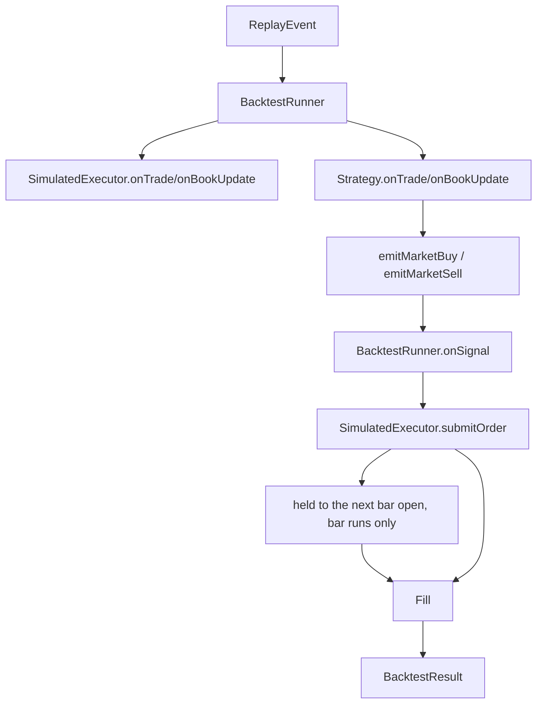

# BacktestRunner

`BacktestRunner` replays historical market data through a strategy, simulates order execution, and collects performance statistics. Supports both batch and interactive modes.

```cpp
class BacktestRunner : public ISignalHandler
{
public:
  using EventCallback = std::function<void(const replay::ReplayEvent&, const BacktestState&)>;
  using PauseCallback = std::function<void(const BacktestState&)>;

  explicit BacktestRunner(const BacktestConfig& config = {});

  // Strategy setup
  void setStrategy(IStrategy* strategy);
  void addMarketDataSubscriber(IMarketDataSubscriber* subscriber);
  void addExecutionListener(IOrderExecutionListener* listener);

  // Custom executor / pre-trade gates
  void setExecutor(IOrderExecutor* executor) noexcept;
  IOrderExecutor* customExecutor() const noexcept;
  void setRiskManager(IRiskManager* rm) noexcept;
  void setOrderValidator(IOrderValidator* ov) noexcept;
  void setKillSwitch(IKillSwitch* ks) noexcept;
  void setPnLTracker(IPnLTracker* tracker) noexcept;

  // Non-interactive mode
  BacktestResult run(replay::IMultiSegmentReader& reader);
  BacktestResult runBars(const std::vector<BarEvent>& bars);
  BacktestResult runTape(const std::filesystem::path& data_dir);
  BacktestResult runTapes(const std::vector<std::filesystem::path>& data_dirs);

  // Interactive mode
  void start(replay::IMultiSegmentReader& reader);
  void resume();
  void step();
  void stepUntil(BacktestMode mode);
  void pause();
  void stop();

  // Breakpoints
  void addBreakpoint(Breakpoint bp);
  void clearBreakpoints();
  void setBreakOnSignal(bool enable);

  // State inspection
  BacktestState state() const;
  bool isPaused() const;
  bool isFinished() const;

  // Callbacks (interactive mode)
  void setEventCallback(EventCallback cb);
  void setPauseCallback(PauseCallback cb);

  // Results
  BacktestResult result() const;
  BacktestResult extractResult();  // Move results out (clears internal state)

  // ISignalHandler
  void onSignal(const Signal& signal) override;

  // Access internals
  SimulatedExecutor& executor() noexcept;
  IClock& clock() noexcept;
  const BacktestConfig& config() const noexcept;
};
```

## Entry Points

| Method | Input | Notes |
|--------|-------|-------|
| `run(reader)` | An `IMultiSegmentReader` | The general path |
| `runBars(bars)` | A `std::vector<BarEvent>` | Each bar updates the `SimulatedExecutor` — open first, then low, high and close, so resting orders and SL/TP match against the intrabar extremes — and is then dispatched to `Strategy::onBar` and any registered subscriber. An order the callback emits is held for the next bar's open (see below). Bars must be in non-decreasing `endTime` order |
| `runTape(dir)` | One `.floxlog` directory | Opens the tape via `replay::createMultiSegmentReader`. Throws if `dir` is not a `.floxlog` directory or holds no segments |
| `runTapes(dirs)` | N `.floxlog` directories, merged on read | Symbols are rekeyed into the engine registry via `(metadata.exchange, name)`, so strategies that pre-resolved venue-tagged symbols see the merger's ids. Throws if any input is not `.floxlog`, or if two inputs declare overlapping book streams for the same symbol (`OverlappingBookStreamError`). `runTapes({t})` equals `runTape(t)` modulo the rekey |

## Bar callbacks fill at the next open

The strategy is shown a bar the simulator has already walked, so open, high, low and close are all
in the market state when its callback runs. An order emitted from there is held and released at the
**next bar's open** for that symbol — the first price that exists after the strategy could have
decided to send it. It is not matched against the bar it was shown, and not against the next bar's
extremes either.

- An order emitted on the last bar never fills: there is no next open. It is still held when the run
  ends, visible as `executor().heldOrderCount()`.
- Deferring does not drop, split or resize the order, and a cancel in the same callback pulls it
  before it is ever submitted.
- An order emitted for a *different* symbol waits for that symbol's next bar, not for the next bar
  of any symbol.
- This applies to the built-in simulator. A custom executor installed with `setExecutor` receives
  signals directly and owns its own matching, so it is on its own here.

Tick and book replay (`run`, `runTape`, `runTapes`) is not affected: there the next event is the
next price, and the strategy callback runs after the event has been matched.

## Reruns

Every entry point — `run`, `runBars`, `runTape`, `runTapes` and interactive `start` — clears the
previous run first: the executor's fills, live, held and conditional orders, market state and
ladder, the built-in position tracker, the clock, and the event counters. A second run therefore
reports that run, not the sum of every run so far, and repeats bit for bit.

What is **not** cleared: configuration of any kind (slippage, queue model, latencies, rate limits,
gates, listeners, subscribers, breakpoints) and anything owned outside the runner — a `VenueStack`'s
account, fee schedule, funding state and liquidation engine, and any book pushed by hand into the
executor before the run. Push it again if the run depends on it.

## Pre-Trade Gates

All four hooks are optional; an unset hook is a no-op. The runner holds raw pointers and does not
delete them.

Gates fire on entry-type signals (`Market`, `Limit`, `Stop*`, `TakeProfit*`, `TrailingStop`) and on
the order they produce. `Cancel`, `CancelAll` and `Modify` pass through ungated — they reduce, not
add, exposure. Reduce-only orders also bypass: when caps tighten you do not want to be stuck in a
position.

`setExecutor` replaces the built-in `SimulatedExecutor` for signal routing (submit, cancel, replace,
OCO, cancelAll). The simulator is left intact to match live data into `BacktestResult`; the custom
executor must report fills through its own execution-listener path. Pass `nullptr` to revert. The
caller retains ownership.

## Two Modes

### Non-Interactive Mode

Synchronous execution from start to end:

```cpp
BacktestRunner runner(config);
runner.setStrategy(&strategy);

// Blocks until complete
BacktestResult result = runner.run(*reader);
```

### Interactive Mode

Async execution with pause/step control. See [Interactive Backtest Mode](../../../how-to/interactive-backtest.md) for full documentation.

```cpp
BacktestRunner runner(config);
runner.setStrategy(&strategy);

// Start in background (begins paused)
std::thread t([&]() { runner.start(*reader); });

// Control execution
runner.step();    // One event
runner.resume();  // Run until breakpoint/end
runner.pause();   // Pause execution

t.join();
```

## Strategy Setup

```cpp
void setStrategy(IStrategy* strategy);
void addMarketDataSubscriber(IMarketDataSubscriber* subscriber);
```

`setStrategy` connects the strategy to receive market events. Use `addMarketDataSubscriber` to add additional subscribers (e.g., bar aggregators, analytics).

## Data Flow



## Usage

```cpp
// 1. Config
BacktestConfig config;
config.initialCapital = 10000.0;
config.feeRate = 0.0004;

// Optional: realistic fill simulation.
config.defaultSlippage = {SlippageModel::FIXED_BPS, 0, Price{}, 1.0, 0.0};
config.queueModel = QueueModel::TOB;
config.riskFreeRate = 0.0;
config.metricsAnnualizationFactor = 252.0;

BacktestRunner runner(config);

// 2. Strategy
MyStrategy strategy(/*params*/);
runner.setStrategy(&strategy);

// 3. Execution listeners (optional)
runner.addExecutionListener(&positionTracker);

// 4. Data
replay::ReaderFilter filter;
filter.symbols = {1};
auto reader = replay::createMultiSegmentReader("./data", filter);

// 5. Run
BacktestResult result = runner.run(*reader);
auto stats = result.computeStats();

std::cout << "Return: " << stats.returnPct << "%\n";
std::cout << "Sharpe: " << stats.sharpeRatio << "\n";
```

## Notes

- Virtual clock advances based on event timestamps from reader.
- Strategy receives events in the same order as in real-time.
- Signals are converted to orders and submitted to `SimulatedExecutor`.
- The runner calls `executor.applyConfig(config)` at construction, so slippage, per-symbol overrides, and queue simulation are ready before any events are processed.
- Trade events from the replay stream pass their quantities to the executor via `onTrade(symbol, price, qty, isBuy)`, which is required for queue-simulated fills.
- All fills are recorded in `BacktestResult`.
- Each run starts from a clean executor and position tracker; see [Reruns](#reruns).

## See Also

- [Interactive Backtest Mode](../../../how-to/interactive-backtest.md) — Pause, step, breakpoints
- [SimulatedExecutor](./simulated_executor.md) — Order execution simulation
- [BacktestResult](./backtest_result.md) — Performance statistics
- [Slippage](./slippage.md)
- [Queue simulation](./queue_simulation.md)
