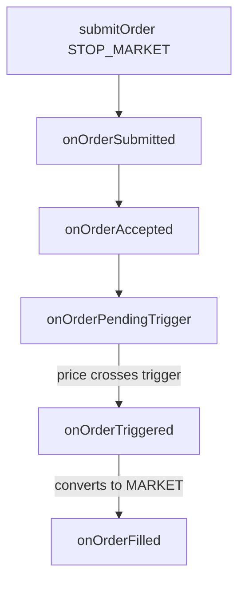
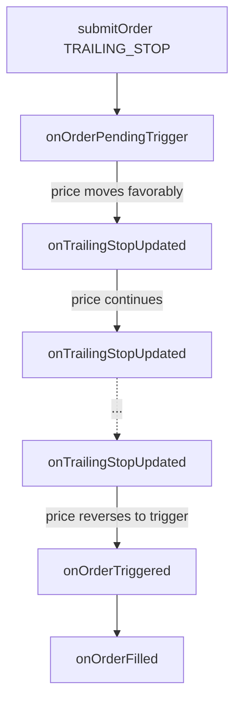

# IOrderExecutionListener

`IOrderExecutionListener` defines the interface for components that react to order lifecycle events. It is used by `OrderExecutionBus` to notify subscribers of changes in order state.

```cpp
class IOrderExecutionListener : public ISubscriber {
public:
  explicit IOrderExecutionListener(SubscriberId id);
  virtual ~IOrderExecutionListener() = default;

  SubscriberId id() const override;

  // Standard order events
  virtual void onOrderSubmitted(const Order& order) {}
  virtual void onOrderAccepted(const Order& order) {}
  virtual void onOrderPartiallyFilled(const Order& order, Quantity fillQty) {}
  virtual void onOrderFilled(const Order& order) {}
  virtual void onOrderPendingCancel(const Order& order) {}
  virtual void onOrderCanceled(const Order& order) {}
  virtual void onOrderExpired(const Order& order) {}
  virtual void onOrderRejected(const Order& order, const std::string& reason) {}
  virtual void onOrderReplaced(const Order& oldOrder, const Order& newOrder) {}

  // Conditional order events
  virtual void onOrderPendingTrigger(const Order& order) {}
  virtual void onOrderTriggered(const Order& order) {}
  virtual void onTrailingStopUpdated(const Order& order, Price newTriggerPrice) {}
};
```

## Purpose

* Provide a type-safe listener interface for receiving detailed updates on order status transitions.

## Standard Order Events

| Method                   | Triggered On                                       |
| ------------------------ | -------------------------------------------------- |
| `onOrderSubmitted`       | Order submitted to venue or simulator.             |
| `onOrderAccepted`        | Order acknowledged/accepted by the exchange.       |
| `onOrderPartiallyFilled` | Partial fill received; includes fill quantity.     |
| `onOrderFilled`          | Fully filled.                                      |
| `onOrderPendingCancel`   | Cancel request sent, waiting for confirmation.     |
| `onOrderCanceled`        | Canceled by user or system.                        |
| `onOrderExpired`         | Expired due to time-in-force or system conditions. |
| `onOrderRejected`        | Rejected by exchange or risk engine (with reason). |
| `onOrderReplaced`        | Order was replaced with a new one.                 |

## Conditional Order Events

| Method                   | Triggered On                                       |
| ------------------------ | -------------------------------------------------- |
| `onOrderPendingTrigger`  | Conditional order waiting for trigger condition.   |
| `onOrderTriggered`       | Trigger condition met, order converted to market/limit. |
| `onTrailingStopUpdated`  | Trailing stop trigger price moved.                 |

### Conditional Order Flow



### Trailing Stop Flow



## Notes

* Each listener is identified via a stable `SubscriberId`.
* Used in tandem with `OrderEvent::dispatchTo()` to decouple producers from listeners.
* Implemented by components such as `PositionManager`, `ExecutionTracker`, and metrics/reporting modules.
* All methods have default empty implementations.

## See Also

* [OrderEvent](events/order_event.md) — Event structure
* [OrderExecutionBus](bus/order_execution_bus.md) — Event bus
* [Order](order.md) — Order structure
