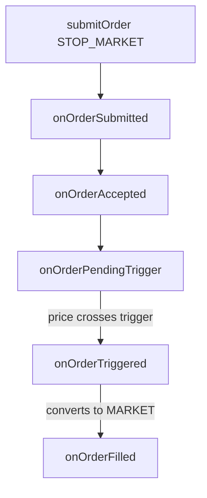
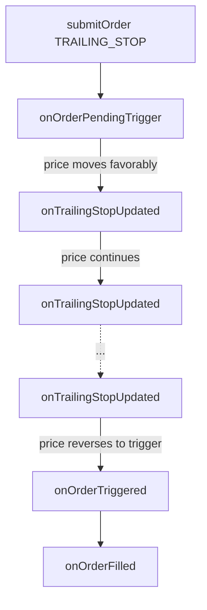

# IOrderExecutionListener

`IOrderExecutionListener` defines the interface for components that react to order lifecycle events. It is used by `OrderExecutionBus` to notify subscribers of changes in order state.

```cpp
class IOrderExecutionListener : public ISubscriber {
public:
  IOrderExecutionListener(SubscriberId id);  // not explicit
  virtual ~IOrderExecutionListener() = default;

  SubscriberId id() const override;

  // Standard order events
  virtual void onOrderSubmitted(const Order& order) {}
  virtual void onOrderAccepted(const Order& order) {}
  virtual void onOrderPartiallyFilled(const Order& order, Quantity fillQty) {}
  virtual void onOrderFilled(const Order& order) {}
  virtual void onOrderPendingCancel(const Order& order) {}
  virtual void onOrderCanceled(const Order& order) {}
  virtual void onOrderExpired(const Order& order) {}
  virtual void onOrderRejected(const Order& order, const std::string& reason) {}
  virtual void onOrderReplaced(const Order& oldOrder, const Order& newOrder) {}

  // Conditional order events
  virtual void onOrderPendingTrigger(const Order& order) {}
  virtual void onOrderTriggered(const Order& order) {}
  virtual void onTrailingStopUpdated(const Order& order, Price newTriggerPrice) {}

  // Backtest-only microstructure events
  virtual void onOrderQueuePositionChange(const Order&, Quantity queueAhead,
                                          Quantity queueTotal) {}
  virtual void onOrderMarketPositionChange(const Order&, uint8_t position,
                                           int32_t distanceToBestTicks) {}

  // Replace-in-flight lifecycle (backtest only)
  virtual void onOrderReplaceSubmitted(const Order& oldOrder, const Order& newOrder) {}
  virtual void onOrderReplaceAccepted(const Order& oldOrder, const Order& newOrder) {}
  virtual void onOrderReplaceRejected(const Order& oldOrder, const Order& newOrder,
                                      const std::string& reason) {}

  // On-chain (DEX) lifecycle
  virtual void onOrderPendingOnchain(const Order&, const std::string& txHash) {}
  virtual void onOrderReverted(const Order&, const std::string& reason) {}
  virtual void onOrderGasReplaced(const Order& oldOrder, const Order& newOrder) {}

  // Raw fan-out; fires AFTER the typed dispatch above
  virtual void onOrderEvent(const OrderEvent& ev) {}
};
```

Every method has an empty default body, so an implementer overrides only what it needs. All 21
virtuals are listed here; missing one silently drops those events rather than failing to compile.

## Purpose

* Provide a type-safe listener interface for receiving detailed updates on order status transitions.

## Standard Order Events

| Method                   | Triggered On                                       |
| ------------------------ | -------------------------------------------------- |
| `onOrderSubmitted`       | Order submitted to venue or simulator.             |
| `onOrderAccepted`        | Order acknowledged/accepted by the exchange.       |
| `onOrderPartiallyFilled` | Partial fill received; includes fill quantity.     |
| `onOrderFilled`          | Fully filled.                                      |
| `onOrderPendingCancel`   | Cancel request sent, waiting for confirmation.     |
| `onOrderCanceled`        | Canceled by user or system.                        |
| `onOrderExpired`         | Expired due to time-in-force or system conditions. |
| `onOrderRejected`        | Rejected by exchange or risk engine (with reason). |
| `onOrderReplaced`        | Order was replaced with a new one.                 |

## Conditional Order Events

| Method                   | Triggered On                                       |
| ------------------------ | -------------------------------------------------- |
| `onOrderPendingTrigger`  | Conditional order waiting for trigger condition.   |
| `onOrderTriggered`       | Trigger condition met, order converted to market/limit. |
| `onTrailingStopUpdated`  | Trailing stop trigger price moved.                 |

## Microstructure Events

Backtest only — live exchanges do not publish queue position.

| Method | Triggered On |
| ------ | ------------ |
| `onOrderQueuePositionChange` | A resting order's queue position moved with no other lifecycle transition. `queueAhead` is the volume in front of the order at its level, `queueTotal` the level's total quantity. |
| `onOrderMarketPositionChange` | A resting order's categorical position changed (best, behind_best, mid_spread, level_empty, crossed). `position` is a `MarketPosition` value passed as `uint8_t` to keep this header free of the event include. `distanceToBestTicks` is signed ticks from best on our side. |

## Replace-in-Flight Events

Backtest only — live venues have their own replace semantics.

| Method | Triggered On |
| ------ | ------------ |
| `onOrderReplaceSubmitted` | Fires immediately on `replaceOrder()`. |
| `onOrderReplaceAccepted` | Fires after the ack latency on a successful replacement. |
| `onOrderReplaceRejected` | The replace could not complete, typically because the original filled inside the ack window. |

The terminal `REPLACED` status still arrives through `onOrderReplaced()`.

## On-Chain (DEX) Events

An on-chain order is probabilistic until confirmed. A strategy must not treat a pending on-chain
order as filled.

| Method | Triggered On |
| ------ | ------------ |
| `onOrderPendingOnchain` | Broadcast to the mempool, not yet confirmed. Carries the tx hash. |
| `onOrderReverted` | The chain rejected the transaction. |
| `onOrderGasReplaced` | Re-broadcast with higher gas, superseding the pending tx. |

Connector-driven; the backtest and CEX paths never emit these.

## Raw Event Fan-Out

| Method | Triggered On |
| ------ | ------------ |
| `onOrderEvent` | Every event, with the full `OrderEvent` payload (queue position, timestamps, maker/taker flag, reject reason). Fires *after* the typed dispatch, so a listener can override both. |

### Conditional Order Flow


```mermaid
flowchart TB
    Submit[submitOrder STOP_MARKET] --> Submitted[onOrderSubmitted]
    Submitted --> Accepted[onOrderAccepted]
    Accepted --> Pending[onOrderPendingTrigger]
    Pending -->|price crosses trigger| Triggered[onOrderTriggered]
    Triggered -->|converts to MARKET| Filled[onOrderFilled]
```

### Trailing Stop Flow


```mermaid
flowchart TB
    Submit[submitOrder TRAILING_STOP] --> Pending[onOrderPendingTrigger]
    Pending -->|price moves favorably| Update1[onTrailingStopUpdated]
    Update1 -->|price continues| Update2[onTrailingStopUpdated]
    Update2 -.->|...| UpdateN[onTrailingStopUpdated]
    UpdateN -->|price reverses to trigger| Triggered[onOrderTriggered]
    Triggered --> Filled[onOrderFilled]
```

## Notes

* Each listener is identified via a stable `SubscriberId`.
* Used in tandem with `OrderEvent::dispatchTo()` to decouple producers from listeners.
* Implemented by components such as `PositionManager`, `ExecutionTracker`, and metrics/reporting modules.
* All methods have default empty implementations.

## See Also

* [OrderEvent](events/order_event.md) — Event structure
* [OrderExecutionBus](bus/order_execution_bus.md) — Event bus
* [Order](order.md) — Order structure
