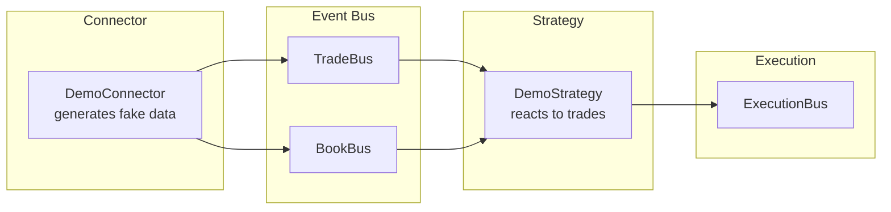

# Quickstart

Build FLOX and run the demo application in 5 minutes.

## 1. Clone and Build

```bash
git clone https://github.com/FLOX-Foundation/flox.git
cd flox

mkdir build && cd build
cmake .. -DFLOX_BUILD_DEMO=ON
make -j"$(getconf _NPROCESSORS_ONLN 2>/dev/null || echo 4)"
```

## 2. Run the Demo

```bash
./demo/flox_demo
```

Logging is switched off for the duration of the run, so nothing
prints until the 30 seconds are up. Then it re-enables logging and
dumps the latency report — one line per label, with `count`, `mean`,
`p50`, `p95` and `max` in nanoseconds:

```
demo finished
[latency] bus_publish | count=... mean=...ns p50=...ns p95=...ns max=...ns
[latency] strategy_onTrade | count=... mean=...ns p50=...ns p95=...ns max=...ns
[latency] execution_onOrderFilled | count=... mean=...ns p50=...ns p95=...ns max=...ns
[latency] end_to_end | count=... mean=...ns p50=...ns p95=...ns max=...ns
```

There is no p99 — the collector reports p95.

## 3. What the Demo Does

The demo creates a complete trading system:



1. **DemoConnector** generates fake trades and order book updates
2. Events flow through **TradeBus** and **BookUpdateBus** (Disruptor-style ring buffers)
3. **DemoStrategy** receives events and submits orders
4. Orders flow through **OrderExecutionBus** to an execution tracker

## 4. Build Options

The most common ones. `FLOX_ENABLE_*` gates capabilities of the core
library, `FLOX_BUILD_*` gates optional artefacts.

| Option | Default | Description |
|--------|---------|-------------|
| `FLOX_BUILD_DEMO` | OFF | Build the demo application |
| `FLOX_BUILD_TESTS` | OFF | Build unit tests |
| `FLOX_BUILD_BENCHMARKS` | OFF | Build performance benchmarks |
| `FLOX_BUILD_PYTHON` | OFF | Build the `flox_py` pybind11 binding |
| `FLOX_BUILD_CAPI` | OFF | Build `libflox_capi.so` (implies `FLOX_ENABLE_BACKTEST`) |
| `FLOX_ENABLE_BACKTEST` | OFF | Build backtest module (simulated execution) |
| `FLOX_ENABLE_LZ4` | ON | Enable LZ4 compression for replay |
| `FLOX_ENABLE_CPU_AFFINITY` | OFF | Enable CPU pinning (requires libnuma) |
| `FLOX_ENABLE_TRACY` | OFF | Enable Tracy profiler integration |

The full set — `FLOX_BUILD_TOOLS`, `FLOX_BUILD_NODE`, `FLOX_BUILD_CODON`,
`FLOX_BUILD_QUICKJS`, `FLOX_BUILD_CONNECTORS`, `FLOX_CONNECTORS`,
`FLOX_NATIVE`, `FLOX_ENABLE_DEV_SETUP` — plus the deprecated
`FLOX_ENABLE_*` artefact aliases is in
[Build feature flags](../build/feature-flags.md).

Example with multiple options:

```bash
cmake .. \
  -DFLOX_BUILD_DEMO=ON \
  -DFLOX_BUILD_TESTS=ON \
  -DFLOX_ENABLE_LZ4=ON \
  -DCMAKE_BUILD_TYPE=Release
```

## 5. Verify Installation

Run the tests to verify everything works:

```bash
cmake .. -DFLOX_BUILD_TESTS=ON
make -j"$(getconf _NPROCESSORS_ONLN 2>/dev/null || echo 4)"
ctest --output-on-failure
```

## Next Steps

- [First Strategy](first-strategy.md) — Write your own trading strategy
- [Architecture Overview](../explanation/architecture.md) — Understand how components fit together
